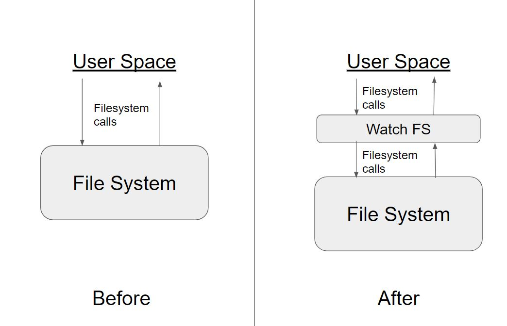
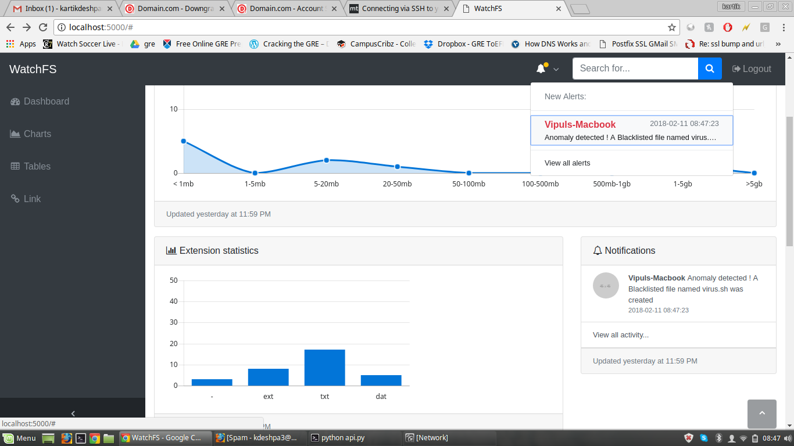
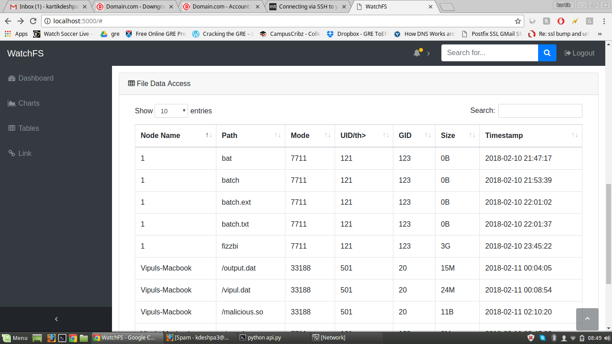

# WatchFS
Real-time Remotely Monitored File System.

---

WatchFS is a file system developed in FUSE (Filesystem in User Space). It records the activity happening on the File System
in real-time and sends it to a remote server via REST API. The server collects the data displays the statistics to the user
via a dashboard.

---

### Detailed description
WatchFS File System is mounted at any given path (mount point) on the user's machine. It then starts intercepting all the
filesystem calls happening over this mount point. Information from these filesystem calls (creating, deleting, writing a file,
etc.) is updated to a remote server via REST API. The filesystem call is then transparently sent to the underlying filesystem.
The remote server stores the aggregated information in a database. It provides a dashboard to the user where they can see the
statistics, charts and notifications about their filesystem.

### Features
* Completely transparent to the end user.
* Real-time remotely monitored.
* Multi-threaded and fault-tolerant client, so the REST API calls don't slow down/block the file system calls.
* Request queueing - for fault tolerance when the remote server is down.
* Real-time issuing of alert when malicious activity or malicious file is detected.
* Coded in Python. ( Yay! ) also had to use html/js/css for front end ( :( )

### Basic Working

---

### Screenshots

